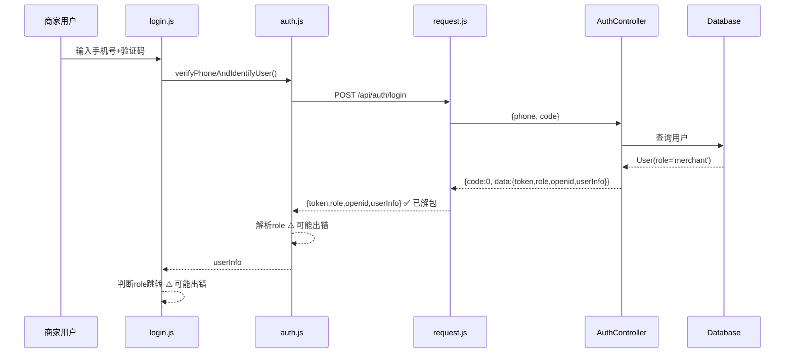

# Design Document: 商家角色识别和界面切换修复

## Overview

本设计文档描述修复"商家登录后仍显示用户界面"问题的技术方案。问题根源在于前后端数据传递和角色状态同步存在多个断点，需要系统性修复。

## Architecture

### 问题诊断流程图



### 当前问题点

1. **数据解析问题**: `request.js` 返回 `result.data`，但 `auth.js` 中的解析逻辑有冗余判断
2. **全局状态不同步**: `app.globalData.isMerchant` 未在登录时正确设置
3. **页面跳转时机**: 跳转发生在数据存储完成之前
4. **mine.js 未检查角色**: "我的"页面没有根据角色显示不同菜单

## Components and Interfaces

### 1. 后端 AuthController 修复

当前代码已正确返回角色，无需修改：

```java
// AuthController.java - 当前实现已正确
Map<String, Object> data = new HashMap<>();
data.put("token", user.getOpenid());
data.put("role", user.getRole());  // ✅ 正确返回 role
data.put("openid", user.getOpenid());
data.put("userInfo", user);
return ApiResponse.ok(data);
```

### 2. 前端 auth.js 修复

简化角色解析逻辑，确保正确获取 role：

```javascript
// auth.js - verifyPhoneAndIdentifyUser 修复
const verifyPhoneAndIdentifyUser = (phoneNumber, verificationCode) => {
  return request.post('/api/auth/login', {
    phone: phoneNumber,
    code: verificationCode
  }).then(res => {
      console.log('[Auth] Login Response:', res);

      // request.js 已经返回 result.data，所以 res 就是 {token, role, openid, userInfo}
      // 直接获取 role，不需要多层判断
      const role = res.role || 'user';
      
      console.log('[Auth] Parsed Role:', role);

      const userInfo = {
          phoneNumber: phoneNumber,
          role: role,  // 确保 role 正确设置
          token: res.token,
          id: res.openid,
          nickname: res.userInfo?.nickname || '',
          avatarUrl: res.userInfo?.avatarUrl || '',
          agreementAgreed: true,
          agreementVersion: '1.0.0',
          agreementTime: Date.now()
      };
      
      // 存储到本地
      wx.setStorageSync('userInfo', userInfo);
      wx.setStorageSync('token', res.token);
      
      // 同步更新全局状态
      const app = getApp();
      if (app) {
          app.globalData.userInfo = userInfo;
          app.globalData.isMerchant = (role === 'merchant');
          app.globalData.userToken = res.token;
      }
      
      return userInfo;
  });
};
```

### 3. 前端 login.js 修复

确保跳转逻辑正确执行：

```javascript
// login.js - handleLogin 修复
auth.verifyPhoneAndIdentifyUser(phoneNumber, verificationCode).then(userInfo => {
    console.log('[Login] Success, userInfo:', userInfo);
    console.log('[Login] Role:', userInfo.role);
    
    // 保存token到全局（auth.js 已做，这里可以省略）
    const app = getApp();
    
    wx.showToast({
        title: '登录成功',
        icon: 'success'
    });
    
    // 延迟跳转，确保 Toast 显示和数据存储完成
    setTimeout(() => {
        const isMerchant = userInfo.role === 'merchant';
        console.log('[Login] isMerchant:', isMerchant);
        
        if (isMerchant) {
            // 商家跳转到管理后台
            wx.navigateTo({
                url: '/pages/merchant/dashboard/dashboard',
                success: () => {
                    console.log('[Login] Merchant redirect success');
                },
                fail: (err) => {
                    console.error('[Login] Merchant redirect failed:', err);
                    // 降级：跳转首页
                    wx.switchTab({ url: '/pages/index/index' });
                }
            });
        } else {
            // 普通用户跳转回调页面或首页
            const redirectUrl = this.callbackPage || '/pages/index/index';
            if (redirectUrl.includes('/pages/index/') || 
                redirectUrl.includes('/pages/mall/') ||
                redirectUrl.includes('/pages/service/') ||
                redirectUrl.includes('/pages/mine/')) {
                wx.switchTab({ url: redirectUrl });
            } else {
                wx.navigateTo({ 
                    url: redirectUrl,
                    fail: () => {
                        wx.switchTab({ url: '/pages/index/index' });
                    }
                });
            }
        }
    }, 1500);
}).catch(error => {
    console.error('[Login] Error:', error);
    wx.showToast({
        title: error.message || '登录失败',
        icon: 'none'
    });
    this.setData({ loading: false });
});
```

### 4. 前端 mine.js 修复

根据角色显示不同菜单：

```javascript
// mine.js - data 修复
data: {
    loading: true,
    userInfo: null,
    isLoggedIn: false,
    isMerchant: false,  // 新增：商家标志
    // ... 其他数据
    
    // 基础菜单（所有用户可见）
    baseMenuItems: [
      { id: 1, name: '我的宠物', icon: '🐱', url: '/pages/pet/list/list?tab=my' },
      { id: 3, name: '收货地址', icon: '📍', url: '/pages/mine/address/address' },
      { id: 5, name: '联系客服', icon: '🎧', url: 'contact' }
    ],
    
    // 商家菜单（仅商家可见）
    merchantMenuItems: [
      { id: 10, name: '商家管理', icon: '🏪', url: '/pages/merchant/dashboard/dashboard' }
    ]
},

// mine.js - checkLoginStatus 修复
checkLoginStatus() {
    this.setData({ loading: true });
    return new Promise((resolve) => {
      const isLoggedIn = auth.isLoggedIn();
      const userInfo = isLoggedIn ? auth.getUserInfo() : null;
      const isMerchant = userInfo?.role === 'merchant';
      
      console.log('[Mine] checkLoginStatus:', { isLoggedIn, role: userInfo?.role, isMerchant });
      
      // 构建菜单列表
      let menuItems = [...this.data.baseMenuItems];
      if (isMerchant) {
          menuItems = [...this.data.merchantMenuItems, ...menuItems];
      }
      
      this.setData({ 
          isLoggedIn,
          userInfo,
          isMerchant,
          menuItems
      });
      
      if (isLoggedIn) {
        Promise.all([
          this.loadOrderStats()
        ]).then(() => {
          this.setData({ loading: false });
          resolve();
        });
      } else {
        this.setData({ loading: false });
        resolve();
      }
    });
}
```

### 5. app.js 修复

确保启动时正确恢复角色状态：

```javascript
// app.js - checkLoginStatus 修复
checkLoginStatus: function() {
    try {
      const userInfo = wx.getStorageSync('userInfo');
      
      if (userInfo) {
        this.globalData.userInfo = userInfo;
        // 直接从 userInfo.role 判断，不依赖单独的 isMerchant 存储
        this.globalData.isMerchant = userInfo.role === 'merchant';
        
        console.log('[App] Restored login status:', {
            role: userInfo.role,
            isMerchant: this.globalData.isMerchant
        });
      }
    } catch (error) {
      console.error('[App] checkLoginStatus failed:', error);
    }
}
```

## Data Models

### UserInfo 数据结构

```javascript
// 前端存储的 userInfo 结构
{
    phoneNumber: "13800138000",
    role: "merchant",           // 关键字段：user | merchant
    token: "openid_xxx",
    id: "openid_xxx",
    nickname: "商家名称",
    avatarUrl: "https://...",
    agreementAgreed: true,
    agreementVersion: "1.0.0",
    agreementTime: 1704067200000
}
```

### 后端返回数据结构

```javascript
// ApiResponse 结构
{
    code: 0,
    errorMsg: "",
    data: {
        token: "openid_xxx",
        role: "merchant",       // 关键字段
        openid: "openid_xxx",
        userInfo: {
            id: 1,
            openid: "openid_xxx",
            phone: "13800138000",
            nickname: "商家名称",
            avatarUrl: "https://...",
            role: "merchant"
        }
    }
}
```


## Correctness Properties

*A property is a characteristic or behavior that should hold true across all valid executions of a system—essentially, a formal statement about what the system should do. Properties serve as the bridge between human-readable specifications and machine-verifiable correctness guarantees.*

### Property 1: 后端登录响应包含完整角色信息

*For any* 登录请求（无论是新用户还是已有用户），后端返回的响应必须包含 `data.token`、`data.role`、`data.openid` 和 `data.userInfo` 四个字段，且 `data.role` 的值为 'user' 或 'merchant'。

**Validates: Requirements 1.1, 1.2, 1.3, 1.4**

### Property 2: 前端正确解析并存储角色

*For any* 成功的登录响应，前端解析后存储的 `userInfo.role` 必须与后端返回的 `data.role` 值相同，且 `app.globalData.isMerchant` 必须等于 `(role === 'merchant')`。

**Validates: Requirements 2.1, 2.2, 2.3, 2.4**

### Property 3: 角色与菜单显示一致性

*For any* 已登录用户访问"我的"页面，当 `userInfo.role === 'merchant'` 时，菜单列表必须包含"商家管理"项；当 `userInfo.role === 'user'` 时，菜单列表不包含"商家管理"项。

**Validates: Requirements 4.2, 4.3, 4.4**

### Property 4: 角色状态持久化和恢复

*For any* 已登录用户，重启应用后 `wx.getStorageSync('userInfo').role` 必须与 `app.globalData.isMerchant` 保持一致（即 `isMerchant === (role === 'merchant')`）。

**Validates: Requirements 5.1, 5.2, 5.3**

### Property 5: 登出清除所有角色状态

*For any* 用户执行登出操作后，`wx.getStorageSync('userInfo')` 必须为空，且 `app.globalData.isMerchant` 必须为 false，`app.globalData.userInfo` 必须为 null。

**Validates: Requirements 5.4**

## Error Handling

### 错误场景处理

| 场景 | 处理方式 |
|------|----------|
| 后端返回 role 为空 | 默认设置为 'user' |
| 商家页面跳转失败 | 降级跳转到首页 |
| Storage 读取失败 | 视为未登录状态 |
| globalData 未初始化 | 跳过全局状态更新 |

### 日志记录

关键节点添加日志，便于调试：

```javascript
console.log('[Auth] Login Response:', res);
console.log('[Auth] Parsed Role:', role);
console.log('[Login] isMerchant:', isMerchant);
console.log('[Mine] checkLoginStatus:', { isLoggedIn, role, isMerchant });
console.log('[App] Restored login status:', { role, isMerchant });
```

## Testing Strategy

### 测试框架

- **前端**: 微信小程序开发者工具 + 手动测试
- **后端**: JUnit 5

### 单元测试

1. **后端 AuthController 测试**
   - 测试商家手机号登录返回 role='merchant'
   - 测试普通手机号登录返回 role='user'
   - 测试新用户注册默认 role='user'

2. **前端 auth.js 测试**
   - 测试解析 {role: 'merchant'} 响应
   - 测试解析 {role: 'user'} 响应
   - 测试 Storage 存储正确性

### 集成测试

1. **商家登录流程测试**
   - 使用商家手机号登录
   - 验证跳转到商家管理页面
   - 验证"我的"页面显示商家菜单

2. **普通用户登录流程测试**
   - 使用普通手机号登录
   - 验证跳转到首页
   - 验证"我的"页面不显示商家菜单

3. **状态持久化测试**
   - 登录后关闭小程序
   - 重新打开验证角色状态正确

### 测试数据

```sql
-- 确保数据库中有商家用户
UPDATE users SET role = 'merchant' WHERE phone = '13800138000';
-- 或指定 openid
UPDATE users SET role = 'merchant' WHERE openid = 'openid_13800138000';
```

