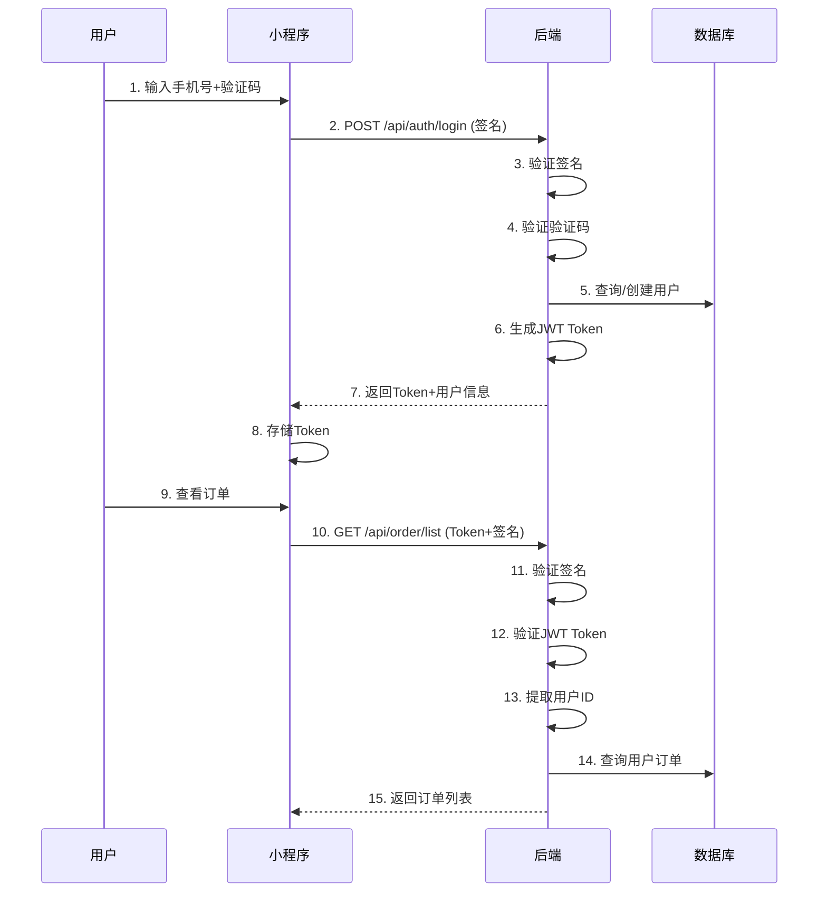
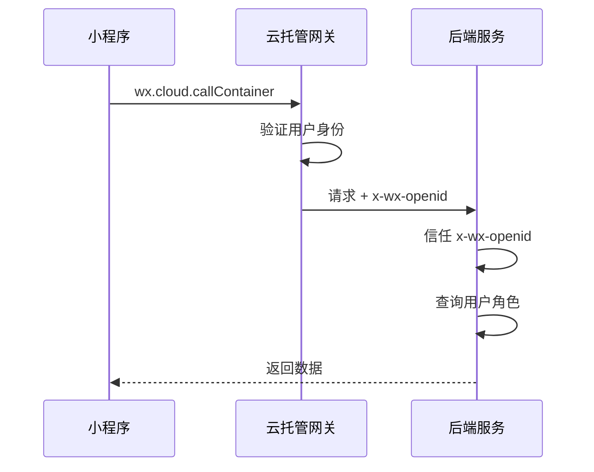

# Design Document: Security Fixes

## Overview

本设计文档描述宠物商城项目安全漏洞修复的技术方案。修复涵盖前端（微信小程序 JavaScript）和后端（Spring Boot Java）两部分，重点解决敏感信息泄露、身份认证不安全、权限控制缺失等问题。

## Architecture

### 整体架构

```
┌─────────────────────────────────────────────────────────────┐
│                    微信小程序前端                              │
├─────────────────────────────────────────────────────────────┤
│  ┌─────────────┐  ┌─────────────┐  ┌─────────────────────┐  │
│  │ Request_Util│  │  Auth_Util  │  │    Cache_Util       │  │
│  │ (签名/加密)  │  │ (Token管理) │  │   (缓存管理)         │  │
│  └──────┬──────┘  └──────┬──────┘  └─────────────────────┘  │
│         │                │                                   │
│         └────────┬───────┘                                   │
│                  ▼                                           │
│         ┌─────────────────┐                                  │
│         │  API Gateway    │                                  │
│         │ (统一请求入口)   │                                  │
│         └────────┬────────┘                                  │
└──────────────────┼──────────────────────────────────────────┘
                   │ HTTPS + 签名验证
                   ▼
┌─────────────────────────────────────────────────────────────┐
│                    Spring Boot 后端                          │
├─────────────────────────────────────────────────────────────┤
│  ┌─────────────────────────────────────────────────────┐    │
│  │              Security Filter Chain                   │    │
│  │  ┌──────────┐  ┌──────────┐  ┌──────────────────┐   │    │
│  │  │签名验证   │→ │JWT验证   │→ │ 权限验证          │   │    │
│  │  └──────────┘  └──────────┘  └──────────────────┘   │    │
│  └─────────────────────────────────────────────────────┘    │
│                          │                                   │
│  ┌───────────────────────┼───────────────────────────────┐  │
│  │                Controllers                             │  │
│  │  ┌──────────┐  ┌──────────┐  ┌──────────────────┐     │  │
│  │  │AuthCtrl  │  │OrderCtrl │  │ ProductCtrl      │     │  │
│  │  └──────────┘  └──────────┘  └──────────────────┘     │  │
│  └───────────────────────────────────────────────────────┘  │
│                          │                                   │
│  ┌───────────────────────┼───────────────────────────────┐  │
│  │                Services (业务逻辑 + 乐观锁)            │  │
│  └───────────────────────────────────────────────────────┘  │
│                          │                                   │
│  ┌───────────────────────┼───────────────────────────────┐  │
│  │                Database (MySQL)                        │  │
│  │           环境变量配置 + 连接池优化                      │  │
│  └───────────────────────────────────────────────────────┘  │
└─────────────────────────────────────────────────────────────┘
```

### 安全流程



## Components and Interfaces

### 1. 配置管理组件

#### 1.1 微信云托管特殊说明

微信云托管环境有以下特点需要考虑：
- **x-wx-openid**: 云托管会自动在请求头中注入用户的 openid，无需前端传递
- **内网访问**: 云托管服务之间可通过内网访问，数据库连接使用内网地址
- **环境变量**: 通过云托管控制台配置环境变量，而非 .env 文件
- **wx.cloud.callContainer**: 小程序调用云托管服务的标准方式

#### 1.2 后端配置 (application.yml)

```yaml
server:
  port: 8080  # 云托管服务端口

spring:
  datasource:
    url: jdbc:mysql://${DB_HOST:localhost}:${DB_PORT:3306}/${DB_NAME:cat_mall}?useSSL=false&serverTimezone=Asia/Shanghai
    username: ${DB_USERNAME:root}
    password: ${DB_PASSWORD}  # 通过云托管控制台配置环境变量
    hikari:
      maximum-pool-size: 20
      minimum-idle: 5

jwt:
  secret: ${JWT_SECRET}  # 通过云托管控制台配置
  expiration: 604800000  # 7天

signature:
  secret: ${SIGNATURE_SECRET}  # 通过云托管控制台配置
  timeout: 300000  # 5分钟
```

#### 1.3 云托管环境变量配置

在微信云托管控制台 -> 服务设置 -> 环境变量中配置：

| 变量名 | 说明 | 示例 |
|--------|------|------|
| DB_HOST | 数据库内网地址 | 10.27.108.101 |
| DB_PORT | 数据库端口 | 3306 |
| DB_NAME | 数据库名 | cat_mall |
| DB_USERNAME | 数据库用户名 | root |
| DB_PASSWORD | 数据库密码 | ******** |
| JWT_SECRET | JWT签名密钥(32位以上) | ******** |
| SIGNATURE_SECRET | 请求签名密钥 | ******** |

#### 1.4 前端配置 (appConfig.js)

```javascript
const appConfig = {
  env: __wxConfig ? __wxConfig.envVersion : 'develop',
  // 云托管环境下不需要 apiBaseUrl，使用 wx.cloud.callContainer
  apiBaseUrl: '',
  // 敏感配置不在前端存储，运行时从后端获取存入内存
  cloud: {
    env: 'prod-2g8xmr3r62fda42b',
    service: 'springboot-o551',
    useCloudContainer: true
  }
};
```

### 2. JWT 认证组件

#### 2.1 微信云托管身份认证说明

微信云托管会自动在请求头中注入以下信息：
- `x-wx-openid`: 用户的 openid（已验证）
- `x-wx-unionid`: 用户的 unionid（如果有）
- `x-wx-source`: 请求来源

**重要**: 云托管注入的 `x-wx-openid` 是经过微信验证的，可以直接信任。但我们仍需要 JWT 来：
1. 存储用户角色等业务信息
2. 支持非云托管环境（本地开发）
3. 实现 Token 刷新机制

#### 2.2 JwtUtil.java

```java
public interface JwtUtil {
    /**
     * 生成JWT Token
     * @param openid 微信openid（来自云托管注入或登录流程）
     * @param role 用户角色
     * @return JWT Token字符串
     */
    String generateToken(String openid, String role);
    
    /**
     * 验证并解析Token
     * @param token JWT Token
     * @return 解析后的Claims，包含openid和role
     * @throws JwtException Token无效或过期
     */
    Claims validateToken(String token) throws JwtException;
    
    /**
     * 刷新Token
     * @param token 旧Token
     * @return 新Token
     */
    String refreshToken(String token);
}
```

#### 2.3 JWT Token 结构

```json
{
  "header": {
    "alg": "HS256",
    "typ": "JWT"
  },
  "payload": {
    "sub": "openid_xxx",
    "role": "user",
    "iat": 1704067200,
    "exp": 1704672000
  },
  "signature": "HMACSHA256(...)"
}
```

#### 2.4 云托管环境下的认证流程



### 3. 请求签名组件

#### 3.1 云托管环境下的签名策略

由于云托管已经提供了身份验证（x-wx-openid），签名主要用于：
1. **防篡改**: 确保请求参数未被修改
2. **防重放**: 通过时间戳和 nonce 防止请求重放
3. **本地开发**: 在非云托管环境下提供额外安全保障

#### 3.2 前端签名生成 (signatureUtil.js)

```javascript
const CryptoJS = require('./crypto-js.min.js'); // 微信小程序兼容的加密库

/**
 * 生成请求签名
 * @param {Object} params - 请求参数
 * @param {string} secret - 签名密钥（从后端获取，存于内存）
 * @param {number} timestamp - 时间戳
 * @param {string} nonce - 随机数
 * @returns {string} 签名字符串
 */
function generateSignature(params, secret, timestamp, nonce) {
    // 1. 参数按key排序
    const keys = Object.keys(params || {}).sort();
    let str = '';
    keys.forEach(key => {
        if (params[key] !== undefined && params[key] !== null) {
            str += `${key}=${params[key]}&`;
        }
    });
    
    // 2. 拼接时间戳和随机数
    str += `nonce=${nonce}&timestamp=${timestamp}`;
    
    // 3. HMAC-SHA256 签名
    const signature = CryptoJS.HmacSHA256(str, secret).toString(CryptoJS.enc.Base64);
    
    return signature;
}

module.exports = { generateSignature };
```

#### 3.3 后端签名验证 (SignatureInterceptor.java)

```java
@Component
public class SignatureInterceptor implements HandlerInterceptor {
    
    @Value("${signature.secret}")
    private String signatureSecret;
    
    @Value("${signature.timeout:300000}")
    private long signatureTimeout;
    
    @Override
    public boolean preHandle(HttpServletRequest request, 
                            HttpServletResponse response, 
                            Object handler) {
        // 云托管环境下，如果有 x-wx-openid，可以降低签名验证的严格程度
        String wxOpenid = request.getHeader("x-wx-openid");
        if (wxOpenid != null && !wxOpenid.isEmpty()) {
            // 云托管环境，openid 已验证，签名验证可选
            return true;
        }
        
        // 非云托管环境，严格验证签名
        String signature = request.getHeader("X-Sign");
        String timestamp = request.getHeader("X-Timestamp");
        String nonce = request.getHeader("X-Nonce");
        
        // 验证签名...
        return validateSignature(request, signature, timestamp, nonce);
    }
}
```

### 4. 权限控制组件

#### 4.1 云托管环境下的权限验证

```java
@Component
public class AuthenticationInterceptor implements HandlerInterceptor {
    
    @Autowired
    private UserService userService;
    
    @Override
    public boolean preHandle(HttpServletRequest request, 
                            HttpServletResponse response, 
                            Object handler) {
        String path = request.getRequestURI();
        
        // 公开接口白名单
        if (isPublicPath(path)) {
            return true;
        }
        
        // 优先使用云托管注入的 openid（已验证）
        String openid = request.getHeader("x-wx-openid");
        
        // 本地开发环境降级：使用 Authorization header
        if (openid == null || openid.isEmpty()) {
            String authHeader = request.getHeader("Authorization");
            if (authHeader != null && authHeader.startsWith("Bearer ")) {
                String token = authHeader.substring(7);
                // 验证 JWT 并提取 openid
                openid = jwtUtil.validateToken(token).getSubject();
            }
        }
        
        if (openid == null || openid.isEmpty()) {
            response.setStatus(401);
            return false;
        }
        
        // 查询用户并设置上下文
        User user = userService.getUserByOpenId(openid);
        if (user == null) {
            response.setStatus(403);
            return false;
        }
        
        // 存入请求上下文
        RequestContext.setUser(openid, user.getRole());
        
        // 检查路径权限
        if (path.startsWith("/api/merchant") && 
            !"merchant".equals(user.getRole()) && 
            !"admin".equals(user.getRole())) {
            response.setStatus(403);
            return false;
        }
        
        return true;
    }
    
    @Override
    public void afterCompletion(HttpServletRequest request, 
                               HttpServletResponse response, 
                               Object handler, Exception ex) {
        RequestContext.clear();
    }
}
```

#### 4.2 RequestContext（线程安全）

```java
public class RequestContext {
    private static final ThreadLocal<UserContext> contextHolder = new ThreadLocal<>();
    
    public static void setUser(String openid, String role) {
        contextHolder.set(new UserContext(openid, role));
    }
    
    public static String getOpenid() {
        UserContext ctx = contextHolder.get();
        return ctx != null ? ctx.getOpenid() : null;
    }
    
    public static String getRole() {
        UserContext ctx = contextHolder.get();
        return ctx != null ? ctx.getRole() : null;
    }
    
    public static void clear() {
        contextHolder.remove();
    }
    
    @Data
    @AllArgsConstructor
    private static class UserContext {
        private String openid;
        private String role;
    }
}
```

### 5. 订单服务增强

#### 5.1 乐观锁实现

```java
// Order实体增加版本号
@Version
private Integer version;

// 更新时自动检查版本
@Transactional
public void updateOrderStatus(String orderNo, String status) {
    Order order = orderMapper.getOrderByOrderNoForUpdate(orderNo);
    // 验证状态转换合法性
    // 更新状态（MyBatis-Plus自动处理版本号）
}
```

#### 5.2 权限验证

```java
public List<Order> getOrdersByUserId(String requestUserId) {
    String currentUserId = RequestContext.getUserId();
    if (!currentUserId.equals(requestUserId)) {
        throw new ForbiddenException("无权访问他人订单");
    }
    return orderMapper.getOrdersByUserId(currentUserId);
}
```

### 6. 统一错误处理

#### 6.1 错误响应格式

```java
public class ApiResponse<T> {
    private int code;        // 业务状态码
    private String message;  // 错误信息
    private T data;          // 响应数据
    private String traceId;  // 追踪ID
}
```

#### 6.2 全局异常处理器

```java
@RestControllerAdvice
public class GlobalExceptionHandler {
    
    @ExceptionHandler(ValidationException.class)
    public ApiResponse<?> handleValidation(ValidationException e) {
        return ApiResponse.error(400, e.getMessage());
    }
    
    @ExceptionHandler(UnauthorizedException.class)
    public ApiResponse<?> handleUnauthorized(UnauthorizedException e) {
        return ApiResponse.error(401, "未授权访问");
    }
    
    @ExceptionHandler(ForbiddenException.class)
    public ApiResponse<?> handleForbidden(ForbiddenException e) {
        return ApiResponse.error(403, "权限不足");
    }
    
    @ExceptionHandler(Exception.class)
    public ApiResponse<?> handleException(Exception e) {
        log.error("系统异常", e);
        return ApiResponse.error(500, "系统繁忙，请稍后重试");
    }
}
```

## Data Models

### 1. User 实体增强

```java
@Data
@TableName("users")
public class User {
    @TableId(type = IdType.AUTO)
    private Integer id;
    
    private String openid;
    private String phone;
    private String nickname;
    private String avatarUrl;
    private String role;  // user, merchant, admin
    
    private LocalDateTime createdAt;
    private LocalDateTime updatedAt;
}
```

### 2. Order 实体增强

```java
@Data
@TableName("orders")
public class Order {
    @TableId(type = IdType.AUTO)
    private Integer id;
    
    private String orderNo;
    private String userId;
    private String merchantId;  // 新增：商家ID
    private String status;
    private BigDecimal totalAmount;
    private String itemsJson;
    private String addressSnapshot;
    private String trackingNumber;
    
    @Version
    private Integer version;  // 新增：乐观锁版本号
    
    private LocalDateTime createdAt;
    private LocalDateTime updatedAt;
}
```

### 3. 数据库变更

```sql
-- 添加版本号字段
ALTER TABLE orders ADD COLUMN version INT DEFAULT 0;

-- 添加商家ID字段
ALTER TABLE orders ADD COLUMN merchant_id VARCHAR(64);

-- 添加索引
CREATE INDEX idx_orders_user_id ON orders(user_id);
CREATE INDEX idx_orders_merchant_id ON orders(merchant_id);
CREATE INDEX idx_orders_status ON orders(status);
CREATE INDEX idx_orders_created_at ON orders(created_at);
```


## Correctness Properties

*A property is a characteristic or behavior that should hold true across all valid executions of a system—essentially, a formal statement about what the system should do. Properties serve as the bridge between human-readable specifications and machine-verifiable correctness guarantees.*

### Property 1: 敏感配置不硬编码

*For any* 配置文件（application.yml, appConfig.js 等），扫描其内容时不应包含任何匹配敏感信息模式（数据库密码、API密钥、JWT密钥）的硬编码值。

**Validates: Requirements 1.3**

### Property 2: JWT Token 结构完整性

*For any* 成功登录的用户，生成的 JWT Token 解析后必须包含 `sub`（用户ID）、`role`（角色）、`iat`（签发时间）和 `exp`（过期时间）字段，且 `exp - iat` 等于配置的过期时间。

**Validates: Requirements 2.3, 2.4, 6.1**

### Property 3: 验证码验证正确性

*For any* 登录请求，当验证码有效时应返回成功和 Token；当验证码无效或过期时应返回错误码并拒绝登录。

**Validates: Requirements 2.1, 2.2**

### Property 4: 请求签名 Round-Trip

*For any* 请求参数集合，使用前端签名算法生成的签名，经后端验证算法验证应返回 true；修改任意参数后重新验证应返回 false。

**Validates: Requirements 3.1, 3.2, 3.3, 3.4**

### Property 5: 用户订单访问隔离

*For any* 用户 A 和用户 B（A ≠ B），用户 A 查询订单列表时，返回结果中不应包含任何属于用户 B 的订单。

**Validates: Requirements 4.1, 4.2, 4.4**

### Property 6: 商家权限验证

*For any* 用户访问 `/api/merchant/**` 路径，当用户角色不是 `merchant` 或 `admin` 时，应返回 403 错误。

**Validates: Requirements 4.3**

### Property 7: 乐观锁并发控制

*For any* 订单和两个并发更新请求（使用相同的初始版本号），最多只有一个请求成功，另一个应返回版本冲突错误。

**Validates: Requirements 5.1, 5.2**

### Property 8: 订单状态转换合法性

*For any* 订单状态转换请求，只有符合状态机定义的合法转换（pending→paid, pending→cancelled, paid→shipped, paid→cancelled, shipped→completed）才能成功，其他转换应返回错误。

**Validates: Requirements 5.3, 5.4**

### Property 9: Token 过期处理

*For any* 已过期的 Token，使用该 Token 发起的请求应返回 401 错误；对于即将过期（剩余时间 < 1天）的 Token，系统应在响应中返回新 Token。

**Validates: Requirements 2.5, 6.3, 6.4**

### Property 10: 错误响应格式一致性

*For any* API 错误响应，响应体必须包含 `code`（整数）、`message`（字符串）字段，且业务异常返回对应业务错误码，系统异常返回 500 且不泄露堆栈信息。

**Validates: Requirements 7.1, 7.2, 7.3**

### Property 11: 输入验证完整性

*For any* 创建订单请求，缺少必填字段（userId, totalAmount, itemsJson）或字段格式不正确时，应返回 400 错误和具体的验证失败信息。

**Validates: Requirements 8.1, 8.2, 8.3, 8.4**

## Error Handling

### 错误码定义

| 错误码 | 含义 | 场景 |
|--------|------|------|
| 400 | 请求参数错误 | 输入验证失败、格式错误 |
| 401 | 未授权 | Token 缺失、无效或过期 |
| 403 | 禁止访问 | 权限不足、越权访问 |
| 404 | 资源不存在 | 订单不存在、用户不存在 |
| 409 | 冲突 | 乐观锁版本冲突、状态转换非法 |
| 500 | 服务器错误 | 系统异常 |

### 异常类层次

```
BusinessException (业务异常基类)
├── ValidationException (400)
├── UnauthorizedException (401)
├── ForbiddenException (403)
├── NotFoundException (404)
└── ConflictException (409)
```

### 前端错误处理流程

```javascript
// 统一错误处理
const handleApiError = (error) => {
  switch (error.code) {
    case 401:
      // 清除Token，跳转登录
      clearToken();
      navigateToLogin();
      break;
    case 403:
      showToast('权限不足');
      break;
    case 409:
      showToast('数据已被修改，请刷新重试');
      break;
    default:
      showToast(error.message || '操作失败');
  }
};
```

## Testing Strategy

### 测试框架选择

- **后端**: JUnit 5 + jqwik (Property-Based Testing)
- **前端**: Jest + fast-check (Property-Based Testing)

### 单元测试

单元测试用于验证具体示例和边界条件：

1. **JWT 工具测试**
   - 测试 Token 生成包含所有必需字段
   - 测试过期 Token 验证失败
   - 测试无效签名 Token 验证失败

2. **签名工具测试**
   - 测试空参数签名
   - 测试特殊字符参数签名
   - 测试时间戳边界（刚好5分钟）

3. **状态机测试**
   - 测试所有合法状态转换
   - 测试所有非法状态转换

### 属性测试

属性测试用于验证通用属性，每个测试运行至少 100 次迭代：

```java
// 示例：JWT Token 结构完整性测试
@Property(tries = 100)
void jwtTokenContainsRequiredFields(
    @ForAll @StringLength(min = 10, max = 50) String userId,
    @ForAll("validRoles") String role
) {
    String token = jwtUtil.generateToken(userId, role);
    Claims claims = jwtUtil.validateToken(token);
    
    assertThat(claims.getSubject()).isEqualTo(userId);
    assertThat(claims.get("role")).isEqualTo(role);
    assertThat(claims.getIssuedAt()).isNotNull();
    assertThat(claims.getExpiration()).isNotNull();
}
```

```javascript
// 示例：请求签名 Round-Trip 测试
const fc = require('fast-check');

test('signature round-trip', () => {
  fc.assert(
    fc.property(
      fc.dictionary(fc.string(), fc.string()),
      fc.string(),
      (params, secret) => {
        const { sign, timestamp, nonce } = generateSignature(params, secret);
        const isValid = validateSignature(params, sign, timestamp, nonce, secret);
        return isValid === true;
      }
    ),
    { numRuns: 100 }
  );
});
```

### 测试覆盖要求

| 属性 | 测试类型 | 最小迭代次数 |
|------|----------|--------------|
| Property 1 | 静态分析 | N/A |
| Property 2 | 属性测试 | 100 |
| Property 3 | 属性测试 | 100 |
| Property 4 | 属性测试 | 100 |
| Property 5 | 属性测试 | 100 |
| Property 6 | 单元测试 | N/A |
| Property 7 | 属性测试 | 100 |
| Property 8 | 属性测试 | 100 |
| Property 9 | 属性测试 | 100 |
| Property 10 | 属性测试 | 100 |
| Property 11 | 属性测试 | 100 |

