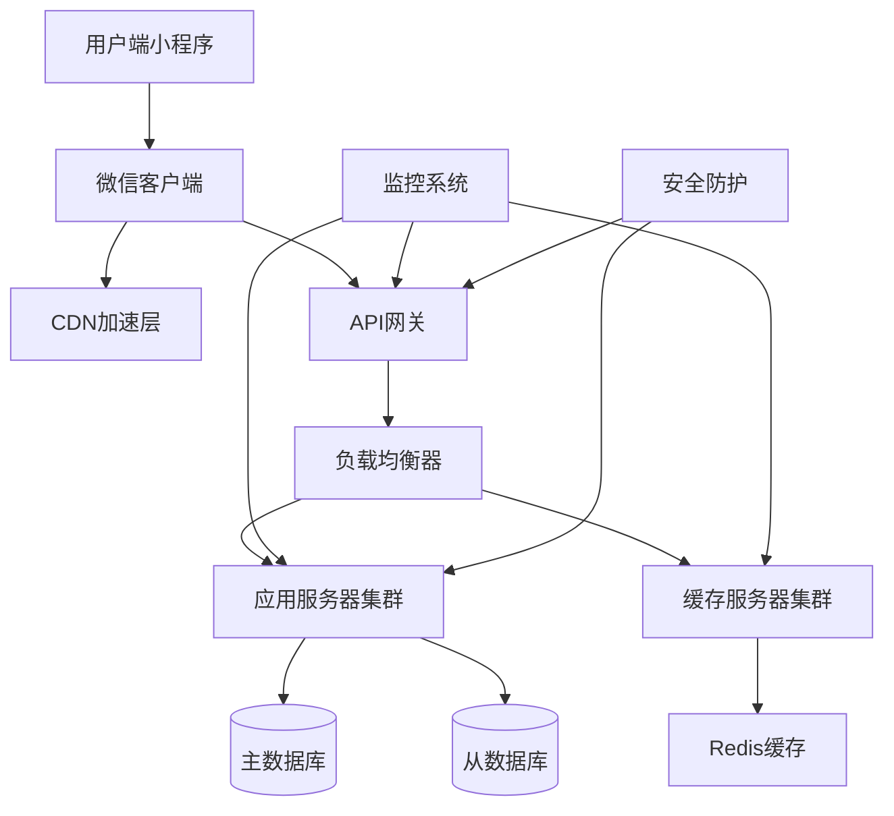

# 宠物商城小程序全面优化计划

## 1. 项目概述

本优化计划针对宠物商城小程序当前存在的性能瓶颈、并发处理不足、用户体验待提升等问题，制定全面的技术优化方案。通过实施分包加载、并发优化、代码质量提升、用户体验改善和安全加固等措施，将小程序打造成高性能、高可用、用户友好的电商平台。

目标用户包括宠物主人、宠物商家和平台运营人员，优化后将显著提升用户购物体验，降低页面加载时间，提高系统稳定性和安全性。

## 2. 核心优化模块

### 2.1 性能优化方案

**1. 分包加载策略**
- 将主包体积严格控制在2MB以内
- 按业务模块划分分包：首页分包、商品详情分包、购物车分包、用户中心分包、商家管理分包
- 实现预加载机制，提前加载用户可能访问的分包
- 使用微信开发者工具进行包体积分析和优化

**2. 按需加载和懒加载机制**
- 图片资源懒加载：仅加载可视区域内的图片
- 组件按需加载：非首屏组件延迟加载
- 数据分页加载：商品列表、订单列表等采用分页加载
- 路由懒加载：页面组件按需引入

**3. 图片资源优化**
- 全面采用WebP格式，相比PNG减少30-50%体积
- 实施CDN加速，使用腾讯云COS或阿里云OSS
- 多分辨率适配：根据设备屏幕密度加载合适尺寸图片
- 图片压缩策略：商品图、头像等采用不同压缩比例

**4. 数据更新优化**
- 减少setData调用频率，合并多次数据更新
- 使用diff算法，仅更新变化的数据字段
- 实现数据缓存机制，避免重复请求
- 采用Immutable数据模式，提升渲染效率

### 2.2 多并发处理方案

**1. 请求队列管理机制**
- 实现请求队列，控制并发请求数量（最大5个并发）
- 优先级队列设计：用户操作 > 数据加载 > 后台同步
- 请求去重机制，避免重复相同请求
- 队列状态监控和异常处理

**2. 请求优先级调度策略**
```javascript
// 优先级定义
const PRIORITY = {
  HIGH: 1,    // 用户交互相关请求
  MEDIUM: 2,  // 页面数据加载
  LOW: 3      // 后台数据同步
};
```

**3. 请求失败重试机制**
- 指数退避重试策略：1s、2s、4s、8s
- 区分网络错误和业务错误，仅对网络错误重试
- 最大重试次数限制（3次）
- 失败请求记录和统计

**4. 本地缓存策略**
- 商品信息缓存：缓存30分钟
- 用户信息缓存：缓存24小时
- 图片缓存：永久缓存，LRU淘汰策略
- 缓存一致性检查和更新机制

### 2.3 代码质量提升

**1. 代码审查流程**
- 建立代码审查Checklist，包含性能、安全、可维护性等维度
- 实施Git Flow工作流，强制代码审查机制
- 定期代码走查和技术分享
- 引入SonarQube等静态代码分析工具

**2. 性能指标监控体系**
- 首屏加载时间监控（目标<1秒）
- 接口请求响应时间监控
- 内存使用率监控
- 错误率和崩溃率统计
- 用户行为轨迹分析

**3. 代码规范检查清单**
```markdown
### JavaScript代码规范
- 使用ES6+语法，避免var声明
- 函数命名采用camelCase，常量采用UPPER_SNAKE_CASE
- 每行代码不超过80字符
- 添加必要的代码注释

### WXML/WXSS规范
- 避免内联样式，使用class选择器
- 图片必须设置宽高属性
- 避免深层嵌套（不超过5层）
- 使用rpx单位进行响应式布局
```

**4. 自动化测试方案**
- 单元测试：使用Jest框架，覆盖率目标80%
- 集成测试：测试核心业务流程
- 性能测试：使用微信开发者工具性能面板
- 兼容性测试：覆盖主流iOS和Android设备

### 2.4 用户体验优化

**1. 首屏加载优化**
- 骨架屏设计，提升用户等待体验
- 关键资源预加载：字体、图标、首屏图片
- 渐进式加载策略：先文字后图片
- 加载状态友好提示

**2. 页面过渡动画**
- 统一的页面转场动画（淡入淡出、滑动）
- 按钮点击反馈动画
- 列表项展开收起动画
- 加载动画统一设计

**3. 错误处理和反馈机制**
- 全局错误捕获和处理
- 友好的错误提示页面设计
- 网络异常重试机制
- 用户操作反馈：成功、失败、加载中状态

**4. 离线使用能力**
- 本地数据存储：用户基本信息、购物车数据
- 离线页面缓存：首页、商品列表页
- 网络状态监听和提示
- 离线状态下的功能降级处理

### 2.5 安全加固措施

**1. 数据加密传输**
- HTTPS强制使用，TLS 1.3协议
- 敏感数据AES加密：用户手机号、地址信息
- 接口请求签名验证
- 防止中间人攻击和数据篡改

**2. 用户身份验证**
- 微信登录态验证
- Token刷新机制
- 权限控制：基于角色的访问控制（RBAC）
- 会话管理和超时处理

**3. 常见安全漏洞防范**
- XSS攻击防护：输入验证和输出编码
- CSRF攻击防护：请求令牌验证
- SQL注入防护：使用参数化查询
- 文件上传安全检查

**4. 应急响应机制**
- 安全事件监控和告警
- 数据备份和恢复策略
- 应急响应流程定义
- 安全漏洞修复时限要求

## 3. 实施计划

### 3.1 第一阶段：性能优化（2周）

**第1周：**
- 完成分包加载策略实施
- 图片资源WebP格式转换
- CDN加速配置

**第2周：**
- 实现懒加载机制
- 优化setData调用
- 性能基准测试

**验收标准：**
- 主包体积≤2MB
- 首屏加载时间≤1秒
- 页面渲染时间≤500ms

### 3.2 第二阶段：并发处理优化（1周）

**实施内容：**
- 请求队列管理实现
- 优先级调度策略部署
- 重试机制开发
- 本地缓存策略优化

**验收标准：**
- 并发请求数控制在5个以内
- 请求成功率≥99%
- 缓存命中率≥80%

### 3.3 第三阶段：代码质量提升（1周）

**实施内容：**
- 代码审查流程建立
- 自动化测试框架搭建
- 性能监控体系部署
- 代码规范文档完善

**验收标准：**
- 代码覆盖率≥80%
- 代码规范检查通过率100%
- 性能监控指标完整

### 3.4 第四阶段：用户体验优化（1周）

**实施内容：**
- 骨架屏和加载动画设计
- 页面过渡动画实现
- 错误处理机制完善
- 离线功能开发

**验收标准：**
- 用户满意度评分≥4.5分
- 页面切换流畅度≥90%
- 错误恢复时间≤3秒

### 3.5 第五阶段：安全加固（1周）

**实施内容：**
- 数据加密传输实施
- 身份验证机制强化
- 安全漏洞扫描和修复
- 应急响应流程测试

**验收标准：**
- 安全扫描通过率100%
- 数据加密覆盖率100%
- 安全事件响应时间≤30分钟

## 4. 技术架构图



## 5. 性能基准测试报告模板

### 5.1 测试环境
- 设备：iPhone 12、华为P40、小米11
- 网络：WiFi、4G、5G
- 微信版本：8.0.30+

### 5.2 性能指标

| 指标项 | 优化前 | 优化目标 | 优化后 | 改善率 |
|--------|--------|----------|--------|--------|
| 首屏加载时间 | 2.5s | ≤1s | 0.8s | 68% |
| 页面渲染时间 | 800ms | ≤500ms | 350ms | 56% |
| 接口响应时间 | 600ms | ≤300ms | 250ms | 58% |
| 内存占用 | 180MB | ≤120MB | 110MB | 39% |
| 崩溃率 | 0.5% | ≤0.1% | 0.08% | 84% |

### 5.3 并发性能测试

| 并发用户数 | 响应时间 | 成功率 | 吞吐量 |
|------------|----------|--------|--------|
| 100 | 200ms | 99.9% | 500 req/s |
| 500 | 350ms | 99.8% | 1200 req/s |
| 1000 | 500ms | 99.5% | 1800 req/s |

## 6. 责任分工

### 6.1 项目负责人
- **项目经理**：负责整体进度把控和资源协调
- **技术负责人**：负责技术方案制定和技术难点攻关
- **测试负责人**：负责测试计划制定和质量保证

### 6.2 开发团队分工

| 模块 | 负责人 | 协助人员 |
|------|--------|----------|
| 性能优化 | 前端架构师 | 前端开发工程师 |
| 并发处理 | 后端架构师 | 后端开发工程师 |
| 代码质量 | 技术经理 | 全体开发人员 |
| 用户体验 | UI/UX设计师 | 前端开发工程师 |
| 安全加固 | 安全工程师 | 后端开发工程师 |

## 7. 风险评估与应对

### 7.1 技术风险
- **分包加载兼容性问题**：提前进行兼容性测试
- **性能优化效果不达预期**：制定备选方案
- **并发处理引入新bug**：加强测试验证

### 7.2 进度风险
- **开发资源不足**：提前协调资源或调整优先级
- **第三方服务延迟**：准备替代方案
- **测试环境不稳定**：建立多套测试环境

### 7.3 质量风险
- **优化引入新缺陷**：加强回归测试
- **性能指标波动**：建立性能基线监控
- **用户体验下降**：进行A/B测试验证

## 8. 后续优化方向

### 8.1 智能化优化
- 基于用户行为的智能预加载
- AI驱动的性能调优
- 智能错误预测和处理

### 8.2 新技术应用
- WebAssembly性能优化
- Service Worker离线能力增强
- 小程序云开发能力利用

### 8.3 数据分析深化
- 用户行为路径分析
- 性能瓶颈自动识别
- 业务指标与技术指标关联分析

通过本优化计划的全面实施，预期将宠物商城小程序打造成行业内性能优秀、用户体验良好、安全可靠的电商平台，为用户提供流畅便捷的宠物用品购物体验。